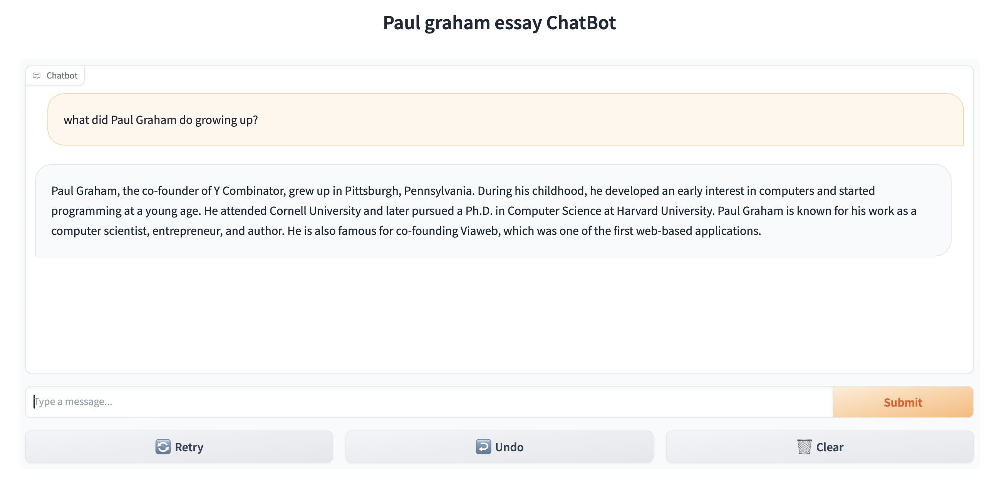

# Data to LLM


 

## Feature
- Chat interface using Gradio
- Vector database using ChromaDB
- Support many data types, using SimpleDirectoryReader
- Chat history, you can ask follow up question to chatbot and it remembers the context.

## Getting Started

### Setting up Environment Variables
Create `.env` file from example
```
copy env-example .env
```

Update variable OPENAI_API_KEY and DATA_NAME in `.env` file, if you don't have one, get a OPENAI API key from [OpenAI](https://platform.openai.com/account/api-keys)

CHROMA_DIR is directory where Chromadb data saved,

DATA_NAME is collection name inside Chroma Vector database.

### Prepare data
Add your data into 'data' dir, supported following data types:

- csv - comma-separated values
- docx - Microsoft Word
- epub - EPUB ebook format
- hwp - Hangul Word Processor
- ipynb - Jupyter Notebook
- jpeg, .jpg - JPEG image
- mbox - MBOX email archive
- md - Markdown
- mp3, .mp4 - audio and video
- pdf - Portable Document Format
- png - Portable Network Graphics
- ppt, .pptm, .pptx - Microsoft PowerPoint

On some data type, you will need to install additional libraries using pip.
For example with epub data will require additional library html2text and ebooklib.

Sample text data taken from [here](https://raw.githubusercontent.com/run-llama/llama_index/main/docs/docs/examples/data/paul_graham/paul_graham_essay.txt).

## Usage
### Run Venv
Run Venv and install requirements
```
cd data-to-llm
python3.10 -m venv .venv
source .venv/bin/activate
pip install -r requirements.txt
```

### Create Index from your data
> If chroma_db directory present, embedding will not start, current data index will be used.
>
> If chroma_db NOT present, embedding will start with your data.

Indexing process will took sometime depends on your data size,

Here an illustration of data indexing using OpenAI embedding model `text-embedding-3-small`

| Data  | Embedding duration  | Cost  | Vector size output  | 
|------------|---------------------|-------|---------------------|
| data1 (253MB) | 50-60 min | $ 0.51  | 1.8 GB  |
| data2 (158MB) | 30-40 min  | $ 0.47  | 1.59 GB  |


### Run Main process

```
% python3 main.py 
Creating index...
Running on local URL:  http://0.0.0.0:7860

To create a public link, set `share=True` in `launch()`.
```

Open your browser at http://localhost:7860

## Q & A

### Does the chat going to cost money?
Yes but not much, I'm doing quite lot testing with chat and within a day it still cost less than $ 0.05.